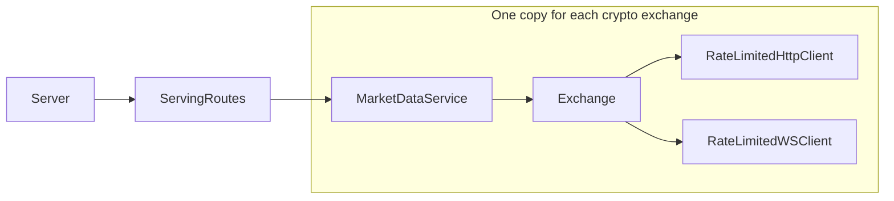
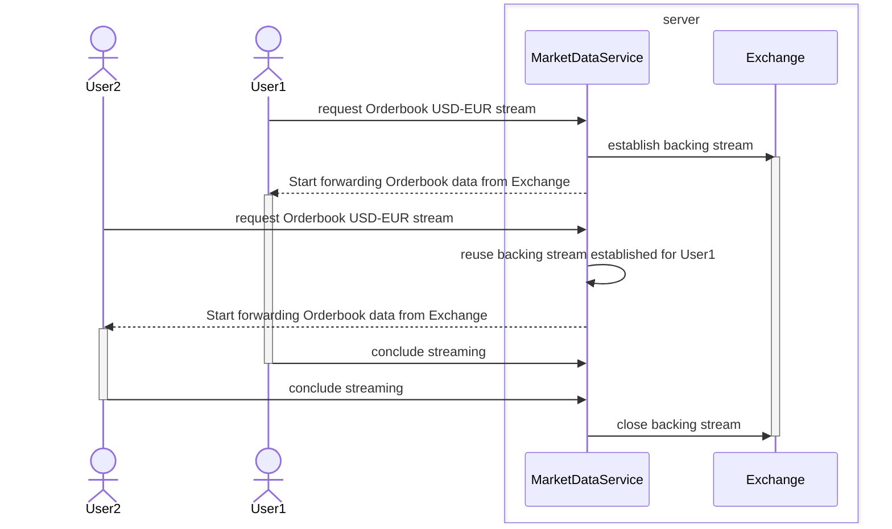
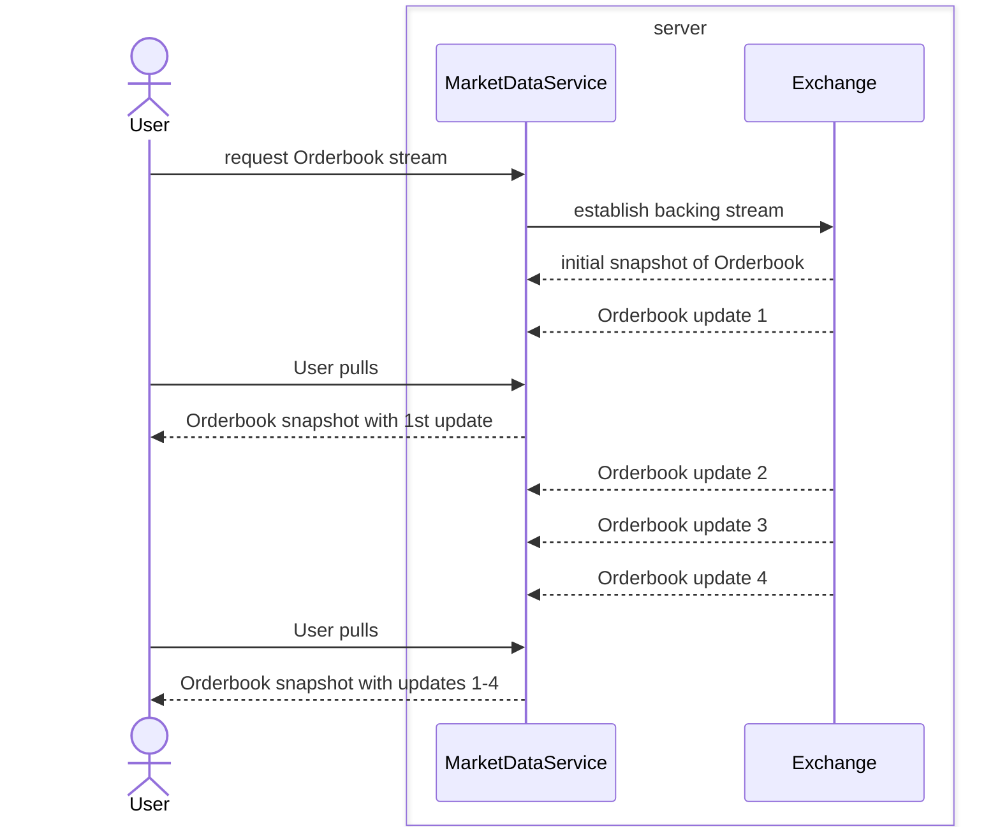

This repo is mainly about a server that consumes a small fragment of the APIs of Binance and Coinbase (cryptocurrency exchanges) and provides a common API for both downstream.
Additionally, when multiple downstream subscribers ask for the same market feed, the server procures a single copy of it from the upstream and shares it among them.

The primary server subproject is under the `./server` directory. There's a live instance of the server hosted on ~~AWS~~Hetzner. You can query this instance using the demo at <https://app.kotopoulion.xyz>. There's also a Grafana dashboard monitoring which market feeds the server is streaming at any given time, found at <https://metrics2.kotopoulion.xyz/d/qWs5DLUIk/number-of-concurrent-streams>.

I came up with this project to give myself an opportunity to explore the [Typelevel stack](https://typelevel.org/).

### Short breakdown of the server subproject. What does each component do?

Arrows pointing upstream

- The MarketDataService contains the bulk of the business logic.
- The Exchange plays the role of the "Repository" for a given crypto exchange.
- The ServingRoutes component contains the routing logic of the server.
- The Server component wraps around ServingRoutes and adds management routes and middleware.

### ServingRoutes component short description

The ServingRoutes component holds two MarketDataService instances, one for Coinbase and one for Binance and routes requests for streaming of market data feeds to the corresponding MarketDataService. The routes it serves are tailored to the demo app which communicates which market feed, trade pair and Exchange to stream from by serializing a description thereof and embedding it as a query parameter which the MarketDataService in turn deserializes. In a real production system these arguments should've been carried by the body of the request rather than the URL, whose length is limited, but this is not a concern here.

### MarketDataService breakdown

#### Initialization

During initalization, the MarketDataService asks its corresponding Exchange (e.g. Coinbase, Binance) for the full list of trade pairs that are being traded. The MarketDataService uses this list to populate a long collection of semaphores, one for each combination of trade pair & market data feed e.g. Orderbook(USD, EUR). These are used to coordinate concurrent requests for streaming which involve reference counting and establishing, reusing and shutting off backing streams from the Exchange.

In addition to this one-off request for the full list of trade pairs, the MarketDataService makes a request for the list of pairs that are being actively traded at the time of the request, caches the result and registers an action to periodically refresh it, so that this list is always relatively fresh. This list is exposed downstream so that users of the demo app see only the active trade pairs.

#### Past initalization

The MarketDataService distributes a data stream from an (cryptocurrency) Exchange to several subscribers at the same time when they all need access to it simultaneously. This can be observed in action by navigating to <https://app.kotopoulion.xyz> on two separate tabs, filling in an identical selection of market feed on both and navigating to <https://grafana.kotopoulion.xyz/d/qWs5DLUIk/number-of-concurrent-streams> on another tab. There should be one stream from Exchange to Server and two copies of the same stream from Server to Demo app.

The MarketDataService consumes the backing stream at the rate dictated by the Exchange. Whenever the User pulls an element, the MarketDataService returns the latest element produced by the backing stream (or snapshot with all the updates applied in the case of incrementally updating streams like the Orderbook). They don't need to see all the inbetween updates.

### Naming conventions

Some directories are named "dto" or "domain". These are there to disambiguate between similarly named DTO and Domain entities. In addition, DTO entities use naming conventions that are not idiomatic to Scala but reflect what they de/serialize from/to.

Directories named "names" declare entities meant to be used as keys in maps, which means equality checking on them should be structural.

### Pragmatic Choices

Could not decide when to use Scala 3 features over scala 2 ones they supersede. Often because I was worried about IDE/ language server maturity.

The app subproject is just a hastily put together demo of how to interact with the server. It’s not an ideal use case due to the way rate limits are enforced by cryptocurrency exchanges such as Binance and Coinbase. These limits are allocated based on the IP addresses of the consumers. Given that these exchanges are relatively generous with their rate limits, there’s no necessity for a server to act as an intermediary that broadcasts data to multiple instances of the demo app.
