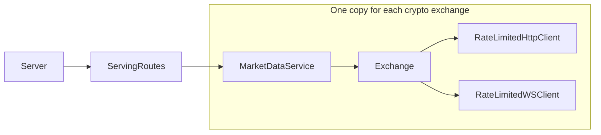
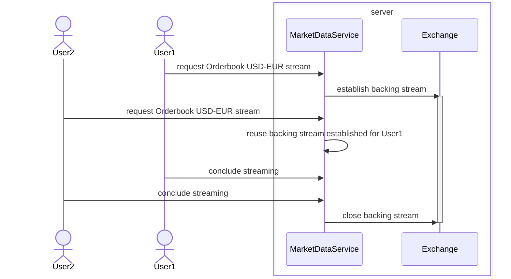
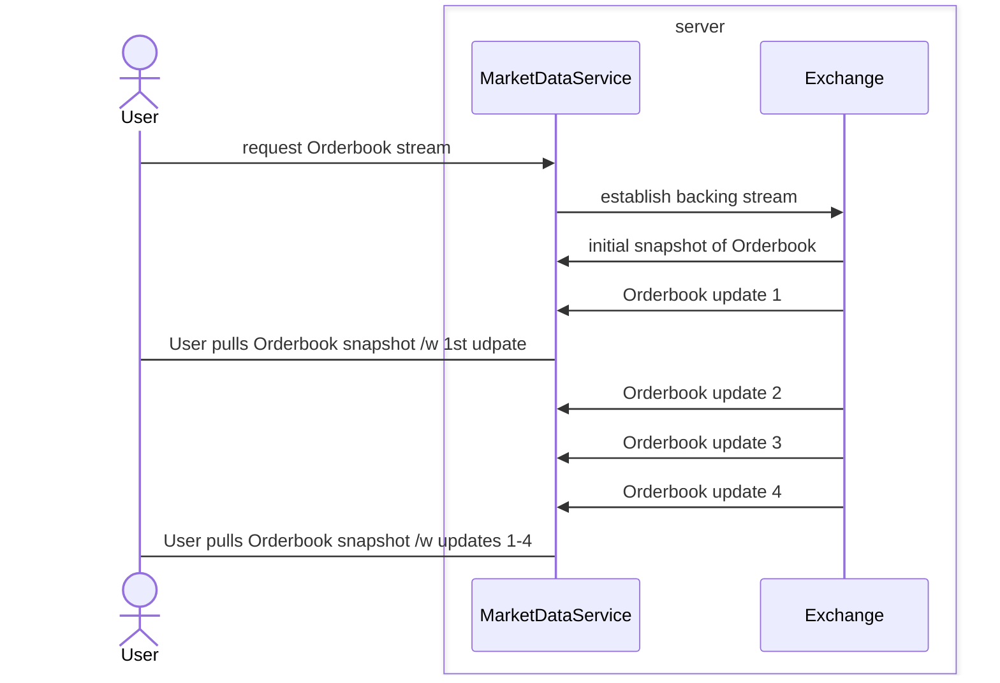

This project consists of the server subproject under the `./server` directory which is the primary subproject, a demo app for the server under the `./app` directory, a live instance of which can be found at <https://app.kotopoulion.xyz> and some cross compiled stuff under `./common`.

I came up with this project to give myself an opportunity to explore the [Typelevel stack](https://typelevel.org/)

I initially followed along the [Typelevel rite of passage course by Daniel Ciocirlan](https://rockthejvm.com/p/typelevel-rite-of-passage) which I heartily recommend. The build file and the demo app contain code from the course.

### Short breakdown of the server subproject. What does each component do?
Arrows moving upstream

- The MarketDataService contains the bulk of the business logic. 
- The Exchange plays the role of the "Repository" for a given crypto exchange. 
- The ServingRoutes component contains the routing logic of the server.
- The Server component wraps around ServingRoutes and adds management routes and middleware.

Maybe MarketDataService and Exchange should not be characterized as components since the Server holds multiple instances of both at runtime.

### ServingRoutes component short description
The ServingRoutes component holds two MarketDataService instances, one for Coinbase and one for Binance and routes requests for streaming of market data feeds to the corresponding MarketDataService. The routes it serves are tailored to the demo app which communicates which market feed, trade pair and Exchange to stream from by serializing a description thereof and embedding it as a query parameter which the MarketDataService in turn deserializes. Convenient but not a good practice.

### MarketDataService breakdown
#### Initialization
During initalization, the MarketDataService asks its corresponding Exchange for the full list of trade pairs that are being traded on said Exchange, this includes trade pairs that are temporarily disabled. The MarketDataService uses this list to populate a long Collection of semaphores, one for each combination of trade pair & market data feed e.g. Orderbook(USD, EUR). These are used to coordinate concurrent requests for streaming which involve reference counting; establishing, reusing and shutting off backing streams from the Exchange. This is assuming this list of trade pairs does not change throughout the lifetime of the server, which is not the case as the exchanges sometimes add totally new trade pairs, but this is sufficiently rare to warrant ignoring.

In addition to this one-off request for the full list of trade pairs, the MarketDataService makes a request for the list of pairs that are being actively traded at the time of the request, caches the result and registers an action to periodically refresh it, so that this list is always relatively fresh. This list is exposed downstream so that users of the demo app see only the active trade pairs.

#### Past initalization
The MarketDataService distributes a data stream from an (cryptocurrency) Exchange to several subscribers at the same time when they all need access to it simultaneously.

The MarketDataService consumes the backing stream at the rate dictated by the Exchange and whenever the User pulls an element the MarketDataService returns the latest element produced by the backing stream (or snapshot with all the updates applied in the case of incrementally updating streams like the Orderbook); they don't need to see all the inbetween updates.

### Naming conventions
Some directories are named "dto" or "domain". These are to disambiguate between similarly named DTO and Domain entities. In addition, DTO entities use naming conventions that are not idiomatic to Scala but reflect what they de/serialize from/to.

Directories named "names" declare entities meant to be used as keys in maps, which means equality checking on them should be structural.

### Disagreeable choices I made
Could not decide when to use Scala 3 features over scala 2 ones they supersede. Often because I was (likely irrationally) worried about IDE/ language server maturity.

The app subproject is just a demo of how to interact with the server. It’s not an ideal use case due to the way rate limits are enforced by cryptocurrency exchanges such as Binance and Coinbase. These limits are allocated based on the IP addresses of the consumers. Given that these exchanges are relatively generous with their rate limits, there’s no necessity for a server to act as an intermediary that broadcasts data to multiple instances of the demo app. Also, don't look at the demo app's code, I did not do a good job there.

